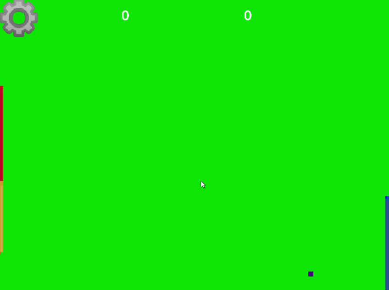
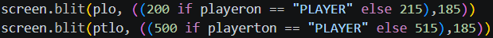
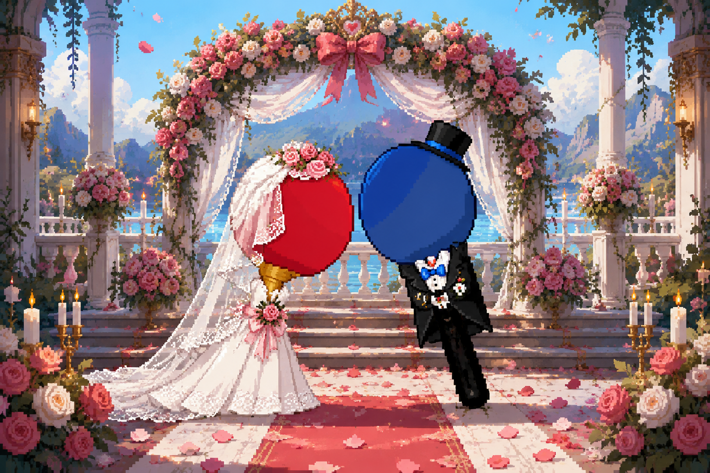

# Racchetta Pong
## MECCANICHE
### gioco ispirato a Pong, l'obiettivo è accumulare più punti mandando la palla nel campo avversario senza fargliela prendere

### si può variare tra bot e player
#### quella di sinistra si muove con W ed S mentre quello di destra con le freccette su e giù

### la palla gialla può cambiare colore
#### in impostazioni c'è un tasto che permette alla pallina di cambiare colore tutte le volte che viene colpita da una racchetta

### il bot diventa più forte
#### più punti si fanno in più del bot diventa preciso e forte
## STORIA DI RACCHETTA PONG
#### è un progetto del dodicenne Leandro Caschetto per kodland fatto con pygame(per installarlo c'è bisogno della versione di python 3.12)

#### in questo gioco ho realizzato la mia prima BEST PRACTICE

### Questo gioco è finanziato dal matrimonio di Racchetta Ping e Racchettat Pong
#### Paddle Pong(protagonista del videogioco originale), il padre di Racchettat Pong, un giorno venne a mancare e Racchettat usò l'eredità per il matrimonio e per un PROGETTO CON LA MOGLIE. Lui voleva usare i soldi per una villa dove trascorrere la vita con la moglie, ma a lei venne una IDEA GENIALE, usare il denaro in modo altruista e fare un campo da ping pong pubblico dove tutti potevano giocare gratuitamente. Per questo il marito volle dare il nome della moglie al gioco.